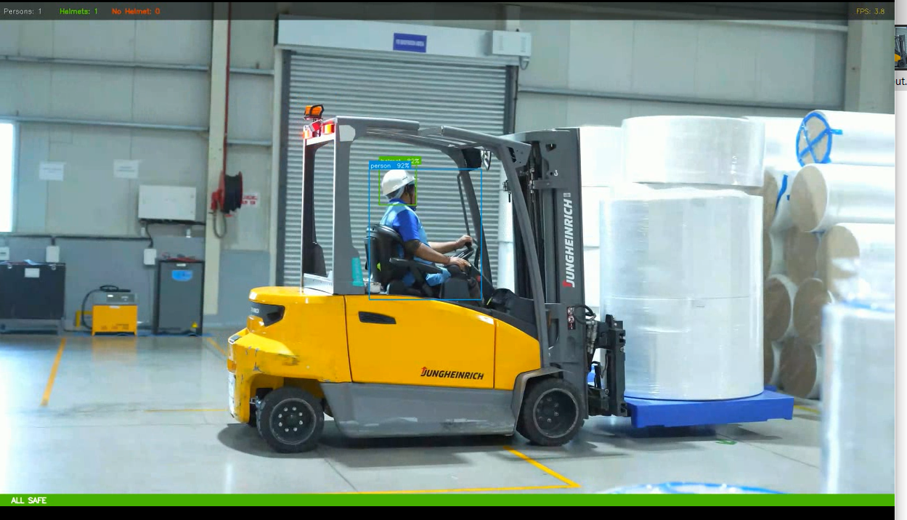
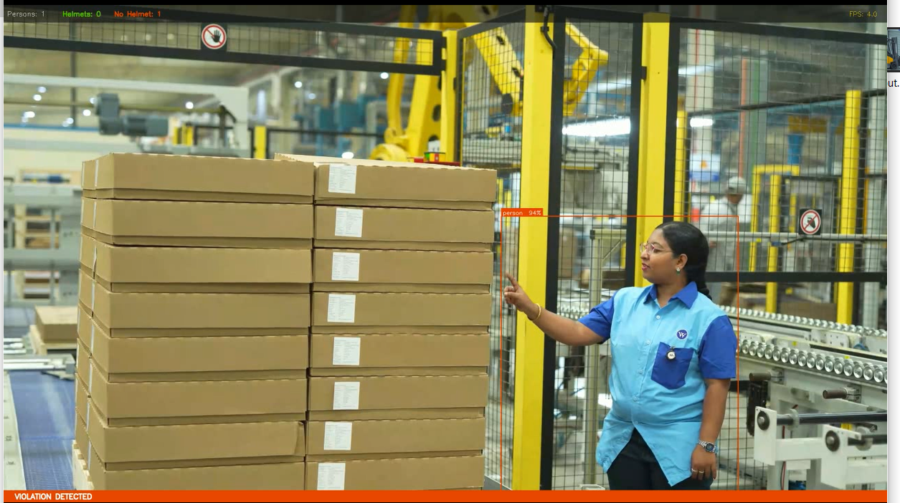

# 🦺 Smart Warehouse — Helmet Detection System

A real-time PPE (Personal Protective Equipment) compliance monitor built with **YOLOv8** and **OpenCV**. The system processes warehouse video feeds, detects workers and their helmet status, flags violations instantly, and logs all events to a CSV file for reporting and auditing.

---

## 📸 Demo

| ✅ All Safe | ❌ Violation Detected |
|:-----------:|:---------------------:|
|  |  |

> **Left:** Worker wearing a helmet — bounding box is blue/green, status bar shows `ALL SAFE`.  
> **Right:** Worker without a helmet — bounding box turns red, status bar shows `VIOLATION DETECTED`.

---

## ✨ Features

- 🎯 **Real-time detection** using a custom-trained YOLOv8 model (`best.pt`)
- 🟢 **Green box** → Helmet detected
- 🔴 **Red box** → Person without helmet (`VIOLATION`)
- 🔵 **Blue box** → Safe person (helmet count covers them)
- 📊 **Live HUD** — Persons / Helmets / No-Helmet counters + FPS overlay
- 🟩 / 🟥 **Status bar** at the bottom of every frame
- 📋 **CSV logging** every 3 seconds — timestamped records for auditing
- 💾 **Output video** saved as `output.mp4`

---

## 🗂️ Project Structure

```
├── main.py              # Main detection & logging script
├── best.pt              # Custom YOLOv8 model weights
├── test1.mp4            # Input video (warehouse footage)
├── output.mp4           # Annotated output video (generated)
├── helmet_log.csv       # Detection log (generated)
└── README.md
```

---

## 🧠 Class Mapping

| Class ID | Label       | Meaning                          |
|:--------:|-------------|----------------------------------|
| `0`      | `person`    | Full body detection              |
| `1`      | `helmet`    | Safety helmet detected ✅        |
| `2`      | `no_helmet` | Head without helmet ❌           |
| `3`      | `head`      | Bare head (treated as violation) |

---

## 📋 CSV Log Format

Saved to `helmet_log.csv` — a new row is appended every **3 seconds** during processing.

| Column             | Description                          |
|--------------------|--------------------------------------|
| `date`             | Date of the record (`YYYY-MM-DD`)    |
| `time`             | Time of the record (`HH:MM:SS`)      |
| `persons_count`    | Number of persons detected           |
| `helmets_count`    | Number of helmets detected           |
| `violations_count` | Number of persons without helmets    |
| `status`           | `SAFE` or `VIOLATION`                |

**Sample rows:**
```
date,time,persons_count,helmets_count,violations_count,status
2026-04-05,19:27:22,1,1,0,SAFE
2026-04-05,19:28:18,2,0,2,VIOLATION
2026-04-05,19:28:34,3,0,3,VIOLATION
```

---

## ⚙️ Configuration

All key parameters are defined at the top of `main.py`:

```python
MODEL_PATH  = "best.pt"      # Path to YOLOv8 weights
VIDEO_PATH  = "test1.mp4"    # Input video
OUTPUT_PATH = "output.mp4"   # Output annotated video
CSV_PATH    = "helmet_log.csv"
CONF        = 0.4            # Detection confidence threshold
SCALE       = 0.5            # Output frame scale (0.5 = 50% of original)
```

---

## 🚀 Getting Started

### 1. Clone the repository
```bash
git clone https://github.com/tasneem123khliel/warehouse-helmet-detection.git
cd warehouse-helmet-detection
```

### 2. Install dependencies
```bash
pip install ultralytics opencv-python
```

### 3. Add your files
Place your model weights (`best.pt`) and input video (`test1.mp4`) in the project root.

### 4. Run
```bash
python main.py
```

Press **`Q`** to quit the live window at any time.

---

## 📦 Requirements

| Package       | Version  |
|---------------|----------|
| `ultralytics` | ≥ 8.0    |
| `opencv-python` | ≥ 4.5  |
| `Python`      | ≥ 3.8    |

---

## 📌 Notes

- Violation logic: `violations = max(0, persons_detected − helmets_detected)`
- If a `no_helmet` or `head` class is detected directly by the model, it is **always** treated as a violation regardless of person count.
- The CSV file is **appended to** on each run — it won't be overwritten.

---

## 🤝 Contributing

Pull requests are welcome! For major changes, please open an issue first to discuss what you'd like to change.

---

## 📄 License

This project is licensed under the [MIT License](LICENSE).
